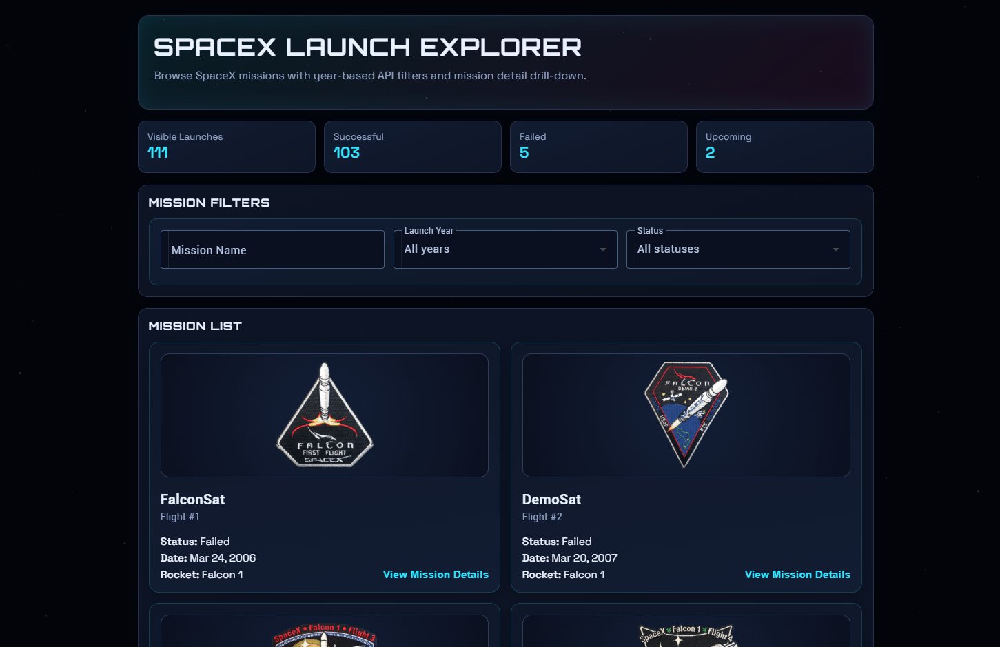
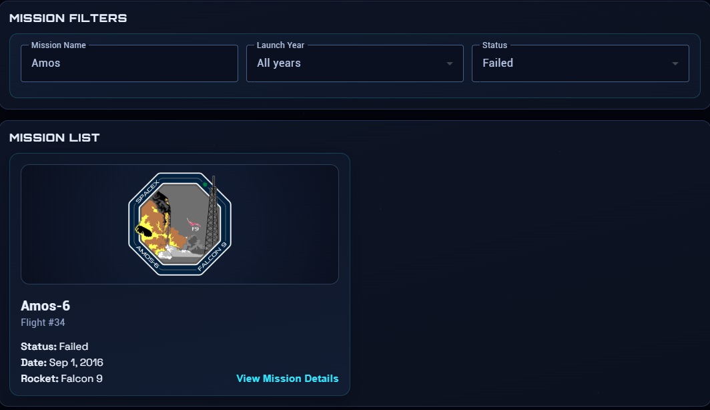
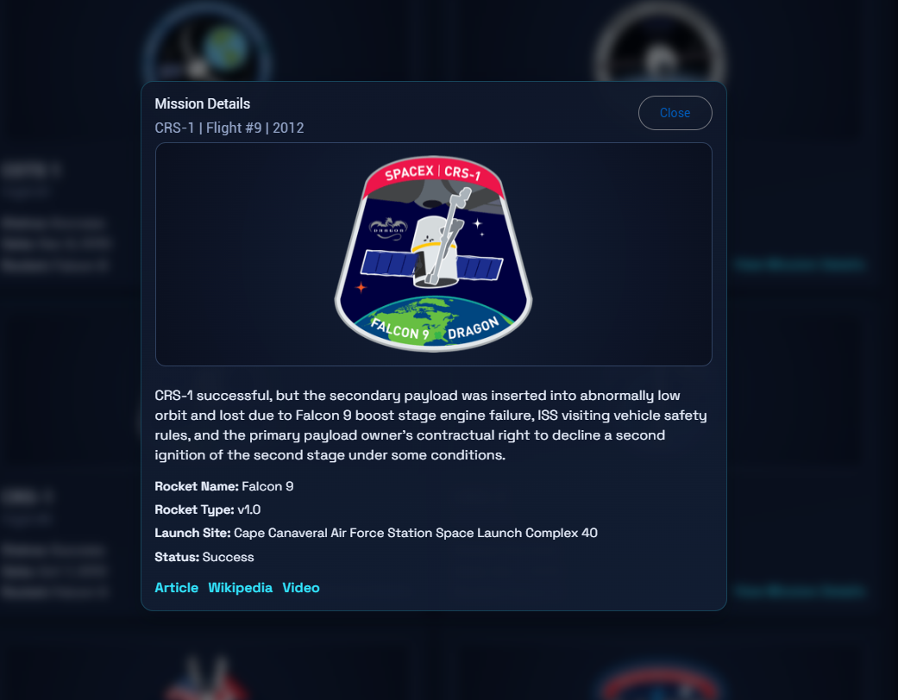

# COMP 3133 Lab Test 2 - SpaceX Mission Theme

## Student Information

- Name: Faraz Safdar
- Student ID: 100775883
- Course: COMP3133
- Lab Test: 2

## Project Overview

This Angular application was created for the COMP 3133 Lab Test 2 assignment. It uses the SpaceX REST API to display launches, filter them by year, and show detailed information for a selected mission.

## What I Built

- Mission list component to show SpaceX launch data
- Mission filter component to search/filter by launch year
- Mission details component to view a selected mission in a popup modal
- Service layer for fetching SpaceX API data
- Interface/model definitions for the API response structure
- Angular Material components for the UI
- Custom themed layout and background styling

## Requirements Covered

- Angular app created with the required project setup
- GitHub repository initialized and code committed
- Mission list component created as [src/app/components/missionlist](src/app/components/missionlist)
- Mission filter component created as [src/app/components/missionfilter](src/app/components/missionfilter)
- Mission details component created as [src/app/components/missiondetails](src/app/components/missiondetails)
- Service created to fetch SpaceX REST API data
- Interface/class created for the data structure
- Angular Material used for the design
- Launch year filter implemented
- Mission details shown for a selected launch
- Application built successfully

## API Endpoints Used

- Launch list: `https://api.spacexdata.com/v3/launches`
- Filter by year: `https://api.spacexdata.com/v3/launches?launch_year=YEAR`
- Mission details: `https://api.spacexdata.com/v3/launches/FLIGHT_NUMBER`

## Tech Stack

- Angular 21
- TypeScript
- RxJS
- Angular Material
- CSS

## Deployment

- Hosting platform: Vercel
- Hosted app link: https://100775883-lab-test2-comp3133.vercel.app/

## Screenshots

The screenshots below are embedded directly in the README.

### Mission List

### Mission Filter

### Mission Details

## Notes

- This project uses SpaceX REST API version 3.
- The UI is built with Angular Material and custom CSS styling.
- I kept the mission details in a modal popup to match the sample images provided in the lab instructions.
